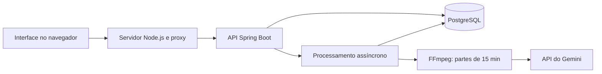

<p align="center">
  
</p>

<p align="center">
  
  
  
  
  
</p>

<p align="center">
  <a href="#funcionalidades">Funcionalidades</a> ·
  <a href="#como-executar">Como executar</a> ·
  <a href="#arquitetura">Arquitetura</a> ·
  <a href="#testes">Testes</a> ·
  <a href="#documentação">Documentação</a>
</p>

# Transcreve

**Áudio em texto. Sem complicação.**

Transcreve é uma aplicação para transcrever áudios em português: aulas, reuniões, conversas e outras falas que você quer guardar em texto. Envie um arquivo ou grave pelo navegador, acompanhe o processamento e copie ou exporte o resultado.

O projeto nasceu para uso pessoal e de amigos, e também como portfólio de desenvolvimento. Combina um backend Java com processamento assíncrono, uma interface em HTML, CSS e JavaScript e integração com a API do Gemini.

## Funcionalidades

| Recurso | O que você pode fazer |
| --- | --- |
| Upload de áudio | Enviar MP3, WAV, M4A, OGG, FLAC, AAC, WEBM, OPUS ou MPEG, com limite de 300 MB. |
| Gravação no navegador | Gravar pelo microfone, ouvir o áudio e enviá-lo para transcrever. |
| Processamento assíncrono | Fechar a página enquanto o backend continua trabalhando. |
| Progresso por parte | Acompanhar quantos segmentos já foram confirmados no banco. |
| Histórico pessoal | Consultar suas transcrições em páginas de até 20 arquivos. |
| Texto pronto para usar | Ler, copiar e exportar a transcrição em `.txt`. |
| Contas individuais | Acessar apenas as transcrições da própria conta. |
| Administração | Criar usuários comuns pela interface, com uma conta `ADMIN`. |
| Limite diário | Enviar até cinco arquivos por usuário, com renovação à meia-noite em São Paulo. |
| Recuperação após reinício | Retomar jobs pendentes ou em processamento, aproveitando partes já salvas. |
| Reprocessamento | Reenfileirar transcrições com erro, reutilizando partes salvas sem consumir outro upload diário. |
| Interface responsiva | Usar a aplicação no computador ou em telas menores. |

O processamento divide os áudios em partes de **15 minutos**, transcreve cada parte e reúne o resultado. O prompt atual solicita transcrição literal em português do Brasil, sem resumo e sem marcas de tempo.

## Como executar

### Pré-requisitos

| Dependência | Requisito |
| --- | --- |
| Java | JDK **25**, conforme o `pom.xml`. |
| Node.js | Versão **22 ou superior**, com npm. |
| PostgreSQL | Servidor local disponível; o projeto foi desenvolvido com PostgreSQL 18. |
| FFmpeg | Executável `ffmpeg` disponível no `PATH`. |
| Gemini | Uma chave de API com acesso ao modelo configurado. |

O Maven Wrapper está incluído; não é necessário instalar Maven separadamente. O frontend não tem dependências npm externas, portanto não precisa de `npm install`.

Os comandos abaixo usam **PowerShell no Windows**. Em Linux ou macOS, adapte as variáveis de ambiente e use `./mvnw` no lugar de `.\mvnw.cmd`.

### 1. Clone o repositório

```powershell
git clone https://github.com/bernas0610/projeto_sistema_transcricao.git
cd projeto_sistema_transcricao
```

### 2. Prepare o banco

Com o PostgreSQL iniciado, crie um banco chamado `transcricao` pelo pgAdmin ou pelo terminal:

```powershell
psql -h localhost -U postgres -c 'CREATE DATABASE transcricao;'
```

A configuração padrão usa `localhost:5432`, banco `transcricao` e usuário `postgres`. O Flyway cria e atualiza as tabelas ao iniciar a aplicação.

### 3. Configure e inicie o backend

No primeiro terminal, a partir da raiz do repositório:

```powershell
cd backend
$env:DB_PASSWORD = 'sua_senha_do_postgres'
$env:GEMINI_API_KEY = 'sua_chave_da_api'

# Somente para criar o primeiro administrador em um banco novo:
$env:ADMIN_EMAIL = 'admin@example.com'
$env:ADMIN_PASSWORD = 'defina_uma_senha_forte'

.\mvnw.cmd spring-boot:run
```

O backend inicia em **http://localhost:8080**. Depois que o administrador for criado, remova `ADMIN_EMAIL` e `ADMIN_PASSWORD` da configuração dos próximos inícios. A conta permanece no banco; essas variáveis não alteram a senha de um admin existente.

Se você já tem um administrador, configure apenas o banco e a chave do Gemini. No IntelliJ, importe `backend/pom.xml`, configure as variáveis na execução de `TranscricaoApplication` e use `backend/` como diretório de trabalho.

### 4. Inicie o frontend

Abra **outro terminal**, também na raiz do repositório:

```powershell
cd frontend
npm run dev
```

Acesse **[http://localhost:5173](http://localhost:5173)** e entre com as credenciais do administrador que você configurou. Mantenha os dois processos rodando.

### 5. Faça sua primeira transcrição

1. Escolha um áudio curto para o primeiro teste ou use **Gravar agora**.
2. Clique em **Transcrever áudio**.
3. Acompanhe o status em **Minhas transcrições**.
4. Quando concluir, abra o texto e use **Copiar** ou **Exportar**.

Para liberar acesso a outra pessoa, entre como admin e abra **Usuários → Criar usuário**. O cadastro público está fechado. A gravação requer permissão de microfone e um navegador com MediaRecorder, em `localhost` ou HTTPS.

## Arquitetura



O servidor Node entrega a interface e encaminha as chamadas da API para o backend na mesma origem, preservando o cookie de sessão e a proteção CSRF. O Spring Boot registra os jobs e executa o processamento em segundo plano. O PostgreSQL guarda contas, status e textos; os áudios são armazenados temporariamente no disco local.

| Camada | Tecnologias |
| --- | --- |
| Backend | Java 25, Spring Boot 4.1.1, Spring Security, Spring Data JPA, Bean Validation e Lombok. |
| Dados | PostgreSQL e migrations Flyway. |
| Áudio e IA | FFmpeg, API do Gemini e interface `TranscriptionProvider`. |
| Frontend | HTML, CSS, JavaScript com ES Modules e servidor HTTP nativo do Node.js. |
| Testes | JUnit, Spring Security Test, H2 e test runner nativo do Node.js. |

### Organização do repositório

```text
projeto_sistema_transcricao/
├── backend/
│   ├── src/main/java/          # API, segurança, serviços e provedor de transcrição
│   ├── src/main/resources/     # Configuração e migrations Flyway
│   ├── src/test/               # Testes do backend
│   ├── .mvn/                  # Maven Wrapper
│   └── pom.xml
├── frontend/
│   ├── public/                # Interface: HTML, CSS e JavaScript
│   ├── test/                  # Testes de validação e do proxy HTTP
│   ├── server.mjs             # Servidor local e encaminhamento à API
│   └── build.mjs              # Prepara os arquivos em dist/
├── docs/                      # Guia técnico e recursos do README
├── uploads/                   # Áudios locais; criado em execução e ignorado pelo Git
└── README.md
```

## Configuração

| Variável | Finalidade | Padrão |
| --- | --- | --- |
| `DB_PASSWORD` | Senha do usuário PostgreSQL. | Obrigatória. |
| `GEMINI_API_KEY` | Chave para transcrever pela API. | Necessária para transcrição. |
| `ADMIN_EMAIL` / `ADMIN_PASSWORD` | Criação do primeiro admin. | Opcionais após o primeiro cadastro. |
| `APP_UPLOAD_DIR` | Diretório persistente dos áudios. | `../uploads`, a partir de `backend/`. |
| `API_TARGET` | Endereço do backend usado pelo frontend. | `http://localhost:8080`. |
| `PORT` | Porta do servidor frontend. | `5173`. |
| `NODE_ENV` | Use `production` para servir o build. | Serve `public/` quando não é `production`. |

Modelo, duração das partes, número de threads e cota diária ficam em [`application.properties`](backend/src/main/resources/application.properties). Para outro banco ou usuário, configure `SPRING_DATASOURCE_URL` e `SPRING_DATASOURCE_USERNAME`. Configure as credenciais no ambiente; arquivos `.env` não são carregados automaticamente pelo projeto.

## Testes

Execute a suíte isolada do backend a partir de `backend/`:

```powershell
.\mvnw.cmd '-Dtest=AuthIntegrationTest,GeminiRetryTest,TranscricaoRecoveryTest,TranscricaoProcessorTest,AudioServiceTest,TranscricaoCheckpointIntegrationTest' test
```

Essa seleção usa H2 e substitutos do provedor e do processador nos testes de integração; não envia áudio ao Gemini nem depende de PostgreSQL. Os testes de divisão de áudio usam FFmpeg e são ignorados quando o executável não está disponível.

A partir de `frontend/`, execute:

```powershell
npm test
npm run build
```

Os testes verificam isolamento entre contas, permissões, cota, recuperação de jobs, tratamento de falhas do Gemini, divisão do áudio, validação de arquivos, escape de HTML e preservação de sessão, CSRF e multipart pelo proxy.

## Limites e comportamento atual

- **Cinco arquivos por usuário/dia:** um upload aceito conta mesmo que a transcrição falhe depois. Gravar sem enviar, recuperar ou reprocessar o mesmo job não consomem outro arquivo.
- **Cota compartilhada do Gemini:** o limite por usuário é independente do limite da API. Um áudio de 90 minutos exige seis partes; custos e disponibilidade dependem da conta e do modelo utilizado.
- **Recuperação por parte:** trechos confirmados no banco são reutilizados. Uma chamada que terminou sem salvar o checkpoint ainda pode ser repetida. Jobs em `ERRO` preservam os checkpoints e podem ser reenfileirados pelo dono, se o original estiver disponível.
- **Uma instância de backend:** ainda não há coordenação de jobs entre várias instâncias.
- **Texto gerado por IA:** a transcrição pode conter erros ou omissões; revise trechos importantes. A configuração atual não inclui timestamps nem identificação estruturada de falantes.
- **Áudio enviado ao provedor:** as partes são transmitidas ao Gemini para transcrição. O backend remove o original após salvar o texto concluído e o preserva em caso de falha.

O projeto está em desenvolvimento e a execução documentada é local. Para publicar, configure HTTPS, persistência dos dados e cookie de sessão seguro. O build do frontend precisa de um servidor que encaminhe a API; hospedagem apenas estática não é suficiente para o fluxo atual.

## Problemas comuns

| Sintoma | O que verificar |
| --- | --- |
| `ERR_CONNECTION_REFUSED` na porta 5173 | Execute `npm run dev` em `frontend/` e mantenha o terminal aberto. |
| Interface abre, mas não conecta ao backend | Inicie o Spring Boot na porta 8080 ou ajuste `API_TARGET`. |
| Falha ao conectar ao banco | Confira PostgreSQL, banco `transcricao`, usuário e `DB_PASSWORD`. |
| Áudio falha no processamento | Confira FFmpeg no `PATH`, chave do Gemini e mensagem do job. |
| Limite diário atingido | Aguarde a renovação da cota correspondente: usuário ou provedor. |

## Documentação

| Documento | Conteúdo |
| --- | --- |
| [00 — Arquitetura](docs/00-ARQUITETURA.md) | Componentes, fluxo de processamento, decisões técnicas, operação e configuração no Windows. |
| [01 — Modelo de dados](docs/01-MODELO%20DE%20DADOS.md) | Entidades, relacionamentos, colunas, migrations e regras da cota diária. |
| [02 — Contrato da API](docs/02-CONTRATO%20DA%20API.md) | Endpoints, autenticação, CSRF, formatos de entrada/saída e códigos HTTP. |
| [03 — SLA e reengajamento](docs/03-SLA%20e%20reengajamento.md) | Comportamento atual, retorno ao fluxo e indicadores propostos, sem prometer um SLA existente. |
| [04 — Backlog](docs/04-BACKLOG.md) | Entregas, validações pendentes, prioridades sugeridas e decisões em aberto. |

---

Desenvolvido por **[Bernardo Mendes](https://github.com/bernas0610)**.
