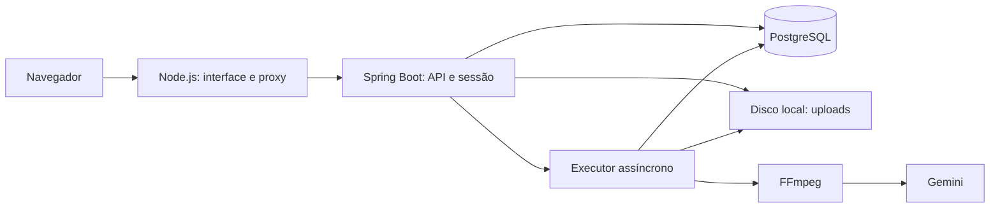

# 00 — Arquitetura

Erros HTTP usam um [contrato público uniforme](02-CONTRATO%20DA%20API.md), inclusive
sessão e CSRF. Falhas assíncronas persistem código e mensagem segura; o processador
não expõe detalhes técnicos do Gemini ou do FFmpeg. A V5 sanitiza erros históricos.
Os [eventos operacionais](05-OBSERVABILIDADE.md) correlacionam fila, partes e retries
por job. A [avaliação de fidelidade](fidelidade/README.md) usa referências e um
comparador offline, sem chamadas adicionais ao provedor.

[← README](../README.md) · [Modelo de dados →](01-MODELO%20DE%20DADOS.md)

## Objetivo e escopo

Transcreve transforma áudio em texto para uso pessoal e de um grupo pequeno de
pessoas. A implementação atual é um monólito Spring Boot com interface web
separada, servidor Node.js e integração externa com o Gemini. A execução documentada
é local e usa uma única instância de backend.

## Visão geral

### Identidade da interface

O produto se chama **Transcreve**. A interface usa tipografia sem serifa,
grafite na navegação, azul nas ações e superfícies em branco e cinza. O símbolo
representa uma onda sonora. Os textos priorizam instruções diretas de gravação,
envio, consulta e exportação. O tema fica em `frontend/public/theme.css`, e o
banner correspondente do README fica em `docs/assets/transcreve.svg`.



| Componente | Responsabilidade |
| --- | --- |
| `frontend/public/` | Login, envio e gravação, histórico, leitura/exportação e criação de usuários. |
| `frontend/server.mjs` | Entregar assets e encaminhar `/auth/*` e `/transcricoes*` ao backend, preservando sessão e CSRF. |
| Controllers | Receber requisições, validar entradas e identificar o usuário autenticado. |
| Spring Security | Autenticação por sessão, BCrypt, CSRF e autorização de cadastro por perfil. |
| `TranscricaoService` | Coordenar armazenamento, registro e início do processamento; listar e consultar jobs do dono. |
| `TranscricaoRegistroService` | Persistir o job e reservar a cota na mesma transação. |
| `CotaUsuarioService` | Contabilizar o uso diário com bloqueio de registro no banco. |
| `ArmazenamentoService` | Salvar originais com nomes UUID e validar arquivo vazio/extensão. |
| `TranscricaoProcessor` | Atualizar status, dividir, transcrever, concatenar e limpar arquivos. |
| `TranscricaoCheckpointService` | Confirmar texto de segmento e contador na mesma transação. |
| `AudioService` | Executar FFmpeg e gerar segmentos MP3 mono de 16 kHz e 32 kbps. |
| `TranscriptionProvider` | Definir o contrato de transcrição; a implementação atual usa Gemini. |
| `TranscricaoRecovery` | Reenfileirar jobs interrompidos após a inicialização. |
| `AdminBootstrap` | Criar o primeiro admin com credenciais fornecidas pelo ambiente. |

## Fluxo de um upload

1. O usuário entra na conta e obtém sessão e token CSRF.
2. O navegador envia multipart com `arquivo`, passando pelo proxy Node.
3. O backend salva o original e registra `PENDENTE`, reservando a cota diária.
4. A API responde `202 Accepted`; o processamento segue no executor.
5. O job passa a `PROCESSANDO`; FFmpeg divide o original em partes de 900 segundos.
6. O provedor transcreve cada parte e o processador reúne os textos na ordem.
7. O backend salva `CONCLUIDA` e remove o original. Falhas produzem `ERRO` e preservam o original.
8. A interface consulta o status e permite copiar ou baixar o texto concluído.

O percentual exibido no envio mede o upload, não o avanço da transcrição.
A API informa `partesConcluidas` e `totalPartes`; a interface mostra esses contadores
no histórico e no detalhe. Cada texto de segmento e o avanço são confirmados
na mesma transação por `TranscricaoCheckpointService`. Na recuperação, FFmpeg
regenera os arquivos com a duração persistida no job, mas apenas os trechos
sem checkpoint voltam ao Gemini. Uma divisão incompatível com os checkpoints
encerra o job com erro, preservando o original e os textos já salvos.

O dono pode reenfileirar um job com erro pelo detalhe na interface.
`TranscricaoRegistroService` bloqueia a linha do job, verifica estado e original
e confirma `ERRO → PENDENTE`. Só depois do commit o serviço dispara o processador.
Os checkpoints são mantidos, sem nova reserva de cota diária de upload.

## Decisões atuais

| Decisão | Motivo e consequência |
| --- | --- |
| Monólito Spring Boot | Mantém API, segurança e processamento no mesmo projeto. |
| Frontend sem framework | HTML, CSS e ES Modules; sem dependências npm externas. |
| Proxy na mesma origem | Preserva cookies e CSRF sem configurar uma integração cross-origin. |
| PostgreSQL + Flyway | Persiste contas e jobs, com evolução explícita do schema. |
| Arquivos no disco | Simplifica o uso local; recuperação depende do original e do caminho persistido. |
| Uma thread de processamento | Padrão de `app.processamento.threads`; limita paralelismo, mas não impõe sozinho limite de requisições por minuto. |
| Gemini atrás de uma interface | Permite implementar outro provedor sem mudar o contrato do processador. |

## Configuração e operação

Execute Maven a partir de `backend/` e Node a partir de `frontend/`. Consulte o
[README](../README.md#configuração) para variáveis de ambiente. O modelo atualmente
configurado é `gemini-3.5-flash`; partes, prompt, timeouts e cota ficam em
[`application.properties`](../backend/src/main/resources/application.properties).

O diretório padrão é `../uploads` a partir de `backend/`. Os caminhos gravados no
banco são absolutos. Alterar `APP_UPLOAD_DIR` afeta novos uploads, sem migrar dados
anteriores. Preserve banco e arquivos ao mover ou reiniciar a aplicação.

O build do frontend copia assets para `frontend/dist/`:

```powershell
# A partir de frontend/
npm run build
$env:NODE_ENV = 'production'
npm start
```

O servidor escuta em `127.0.0.1`. Essa configuração não publica o sistema nem habilita
HTTPS; acesso externo exige um proxy de implantação. Em produção, use HTTPS e
`server.servlet.session.cookie.secure=true`, além de persistência e backups.

### Java no Windows

Se o cliente HTTP falhar com `java.net.SocketException` relacionada ao caminho
temporário do Windows, use um diretório curto para os sockets do JDK. A partir de
`backend/`, com as variáveis do ambiente já configuradas:

```powershell
New-Item -ItemType Directory -Force target/tmp | Out-Null
$socketDir = (Resolve-Path target/tmp).Path.Replace('\', '/')
.\mvnw.cmd "-Dspring-boot.run.jvmArguments=-Djdk.net.unixdomain.tmpdir=$socketDir -Dspring.devtools.restart.enabled=false" spring-boot:run
```

No IntelliJ, use a mesma opção JVM com o caminho absoluto escolhido.

## Limites da arquitetura

Não há fila externa, coordenação entre instâncias, armazenamento em nuvem, sessão
distribuída. Uma reinicialização exige novo login. Chamadas que terminaram sem
checkpoint confirmado podem ser repetidas; partes confirmadas são reutilizadas. Áudios são transmitidos ao provedor; isolamento entre
usuários na API não significa processamento exclusivamente local.

Evoluções planejadas estão no [backlog](04-BACKLOG.md).
