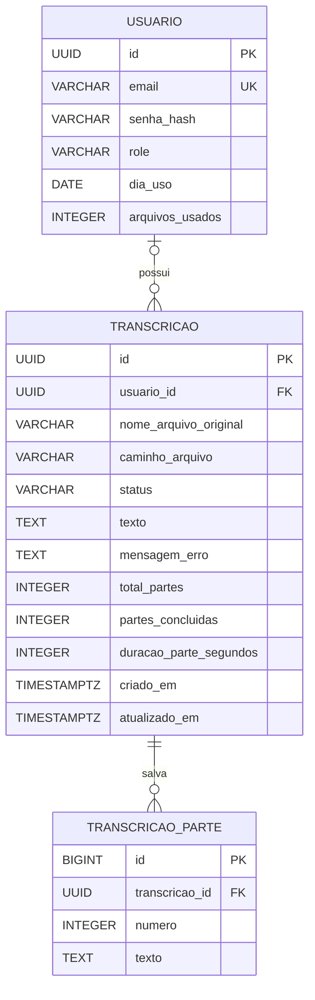

# 01 — Modelo de dados

[← Arquitetura](00-ARQUITETURA.md) · [Contrato da API →](02-CONTRATO%20DA%20API.md)

## Diagrama

Uma conta possui zero ou várias transcrições. O dono é obrigatório no fluxo de
novos uploads, mas a coluna permite `NULL` para preservar registros anteriores à V2.

## Tabela `usuario`

| Coluna | Tipo no PostgreSQL | Nulo? | Regra |
| --- | --- | --- | --- |
| `id` | `UUID` | Não | Chave primária; UUID gerado pela aplicação/JPA. |
| `email` | `VARCHAR(255)` | Não | Único; normalizado com remoção de espaços externos e letras minúsculas no cadastro. |
| `senha_hash` | `VARCHAR(255)` | Não | Hash BCrypt; nunca retornado pela API. |
| `role` | `VARCHAR(20)` | Não | Padrão `USER`; CHECK permite apenas `USER` e `ADMIN`. |
| `dia_uso` | `DATE` | Sim | Data à qual o contador de uso corresponde. |
| `arquivos_usados` | `INTEGER` | Não | Padrão `0`; uploads aceitos na data registrada. |

`USER` acessa suas transcrições. `ADMIN` tem a mesma visibilidade e cota e pode
criar contas `USER`. Não há endpoint para promover contas.

### Contabilização diária

`dia_uso` é calculado no fuso `America/Sao_Paulo`, configurável. Se a data gravada
difere de hoje, a consulta considera o uso igual a zero. Na próxima reserva, o
backend grava a nova data e reinicia o contador. Não existe tarefa agendada
zerando todas as contas à meia-noite.

A reserva usa bloqueio pessimista na conta e participa da transação de criação
da transcrição. O limite é cinco arquivos por padrão. Upload aceito conta mesmo
que o processamento falhe depois; recuperar o mesmo job não altera esse contador.

## Tabela `transcricao`

| Coluna | Tipo no PostgreSQL | Nulo? | Regra |
| --- | --- | --- | --- |
| `id` | `UUID` | Não | Chave primária; UUID gerado pela aplicação/JPA. |
| `usuario_id` | `UUID` | Sim | FK para `usuario(id)`; preenchida com o usuário autenticado em novos uploads. |
| `nome_arquivo_original` | `VARCHAR(255)` | Não | Nome para exibição; nomes maiores são truncados no registro. |
| `caminho_arquivo` | `VARCHAR(500)` | Não | Caminho absoluto do original no disco local. |
| `status` | `VARCHAR(20)` | Não | Enum persistido como texto; novo job começa em `PENDENTE`. |
| `texto` | `TEXT` | Sim | Texto consolidado após conclusão. |
| `mensagem_erro` | `TEXT` | Sim | Mensagem pública definida pelo código, sem resposta bruta do provedor. |
| `codigo_erro` | `VARCHAR(50)` | Sim | Classificação estável da falha; limpo ao iniciar/reprocessar. |
| `total_partes` | `INTEGER` | Não | Padrão `0`; total definido após a divisão do áudio. |
| `partes_concluidas` | `INTEGER` | Não | Padrão `0`; quantidade de checkpoints confirmados. |
| `duracao_parte_segundos` | `INTEGER` | Sim | Duração fixada no início do processamento e reutilizada nas retomadas. |
| `criado_em` | `TIMESTAMP WITH TIME ZONE` | Não | Instant gerenciado pelo Hibernate na criação. |
| `atualizado_em` | `TIMESTAMP WITH TIME ZONE` | Não | Instant gerenciado pelo Hibernate nas alterações. |

Há um índice `idx_transcricao_usuario` em `usuario_id`. A FK não define exclusão
em cascata. A aplicação não oferece exclusão de usuários ou transcrições nesta etapa.

### Estados

| Estado | Significado |
| --- | --- |
| `PENDENTE` | Registrado e aguardando processamento. |
| `PROCESSANDO` | Divisão e/ou transcrição em andamento. |
| `CONCLUIDA` | Texto final salvo. |
| `ERRO` | Execução encerrada com falha. |

Reprocessamento autorizado pelo dono permite `ERRO → PENDENTE`, com bloqueio
transacional na transcrição e validação do original. Mantém checkpoints e
contadores, limpa a mensagem de erro e não altera a cota do usuário.

O enum é validado pela aplicação; a migration não adiciona CHECK para `status`.
O caminho permanece no registro mesmo após a remoção do original concluído.
## Tabela `transcricao_parte`

Cada linha guarda o texto de um segmento confirmado. `id` é `BIGINT` identity;
`transcricao_id` referencia o job com exclusão em cascata; `numero` é um índice
a partir de zero; `texto` é `TEXT` obrigatório. A combinação de job e número é
única. A gravação da parte e do contador do job ocorre na mesma transação.
Os checkpoints permanecem após conclusão ou erro; não há endpoint que exponha
partes separadas. O texto final concatena as partes na ordem original.

O áudio não é armazenado no banco e ainda não há histórico de tentativas.

Jobs anteriores à V4 recebem contadores zero e duração nula. Textos concluídos
permanecem intactos; não são convertidos retroativamente em checkpoints.
Jobs antigos recuperáveis começam a registrar checkpoints na próxima execução.

## Migrations

| Versão | Arquivo | Mudança |
| --- | --- | --- |
| V1 | `V1__criar_tabela_transcricao.sql` | Cria a tabela de transcrições. |
| V2 | `V2__usuarios_e_donos.sql` | Cria usuários, cota diária, FK de dono e índice. |
| V3 | `V3__roles_usuario.sql` | Adiciona perfil `USER` por padrão e CHECK de perfis. |
| V4 | `V4__checkpoints_transcricao.sql` | Cria checkpoints e adiciona contadores e duração da divisão ao job. |
| V5 | `V5__codigo_erro.sql` | Adiciona classificação de erro e sanitiza mensagens antigas de jobs em `ERRO`. |

O Flyway aplica as migrations e mantém sua tabela de histórico. O Hibernate usa
`ddl-auto=validate`. Evoluções de schema devem usar novas migrations.

Transcrições anteriores à V2 ficam sem dono e não são expostas pela API. A
recuperação ainda pode processá-las. Disponibilizá-las requer associar explicitamente
seus IDs a uma conta no banco. Contas anteriores à V3 recebem `USER`.

Fontes: [migrations](../backend/src/main/resources/db/migration/),
[entidades](../backend/src/main/java/com/bernardo/transcricao/model/) e
[serviço de cota](../backend/src/main/java/com/bernardo/transcricao/service/CotaUsuarioService.java).
